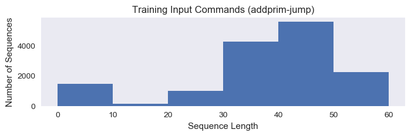
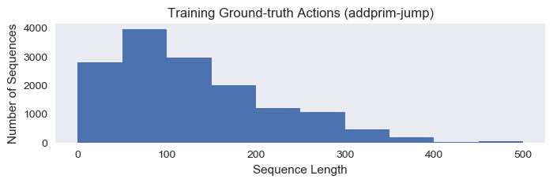
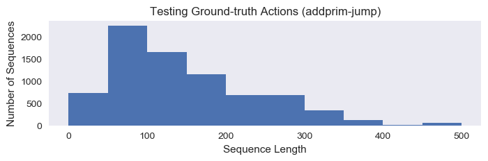

# SCAN-Learn
This is an experiment of compositional learning and zero-shot generalization on the [SCAN task](https://github.com/brendenlake/SCAN) in [*Still not systematic after all these years: On the compositional skills of sequence-to-sequence recurrent networks*.](https://arxiv.org/abs/1711.00350) Lake, B. M. and Baroni, M. (2017). The SCAN tasks were inspired by the CommAI environment, which is the origin of the acronym (Simplified versions of the CommAI Navigation tasks).  

## Requirements
- python 3.5+
- pytorch 0.3+

## Data
**SCAN** consists of a set of commands (see table) and their corresponding action sequences. These are the actions an agent should perform to execute the commands successfully. The commands and actions are defined compositionally based on primitives ("jump", "walk", "run", "turn left", etc.) and modifiers such as "twice", "thrice", "and", "after", "around left", etc. Here are some examples.

|Command | Action sequence |
| --- | --- |
| IN: jump                |                       OUT: JUMP |
| IN: jump left            |                       OUT:  LTURN JUMP |
| IN: jump around right       |                   OUT: RTURN JUMP RTURN JUMP RTURN JUMP RTURN JUMP |
| IN: turn left twice          |                  OUT: LTURN LTURN |
| IN: jump thrice               |                 OUT: JUMP JUMP JUMP |
| IN: jump opposite left and walk thrice   |      OUT: LTURN LTURN JUMP WALK WALK WALK |
| IN: jump opposite left after walk around left | OUT: LTURN WALK LTURN WALK LTURN WALK LTURN WALK LTURN LTURN JUMP |

## Usage
1. Download data from the [SCAN task](https://github.com/brendenlake/SCAN) by Lake, B. M. and Baroni, M. (2017);
2. Process the data with **data_process.py**;
3. Run the model with **s2s_\*.py** `[set options in config.py]`;
4. Evaluate the model with **eval_\*.py** `[set options in config.py]`.  

**NB:** The pre-trained embedding weights we are using is from [GloVe 6B 50D](https://nlp.stanford.edu/projects/glove/).

## Results
The performances of our sequence-to-seqeuence model on various datasets of SCAN tasks are as follows.

| Task | Prior | Max SeqLen | Encoder | Decoder | Average Loss |
|:--------:|:---------:|:---------:|:----------:|:----------:|:----------:|
|Simple Split | None | 10 | GRU | Attn-GRU | 0.0002 |
|Simple Split | None | 50 | GRU | Attn-GRU | Still Running on Prince... |
|Simple Split | None | 100 | GRU | Attn-GRU | 6.9351 |
|Simple Split | Glove 6b 50d | 50 | GRU | Attn-GRU | 0.0921 |
|---|---|---|---|---|--- |
|Addprim_jump | None | 10 | GRU | Attn-GRU | Still Running on Prince... |
|Addprim_jump | Glove 6b 50d  | 10 | GRU | Attn-GRU | Still Running on Prince... |
|Addprim_jump | None | 40 | GRU | Attn-GRU | Still Running on Prince... |
|Addprim_jump | Glove 6b 50d | 40 | GRU | Attn-GRU | 0.0405 |
|Addprim_jump | None | 80 | GRU | Attn-GRU | Still Running on Prince... |
|Addprim_jump | Glove 6b 50d | 80 | GRU | Attn-GRU | Still Running on Prince... |

---
## Appendix

### Sequence Lengths Distribution
#### Training Data

#### Testing Data

