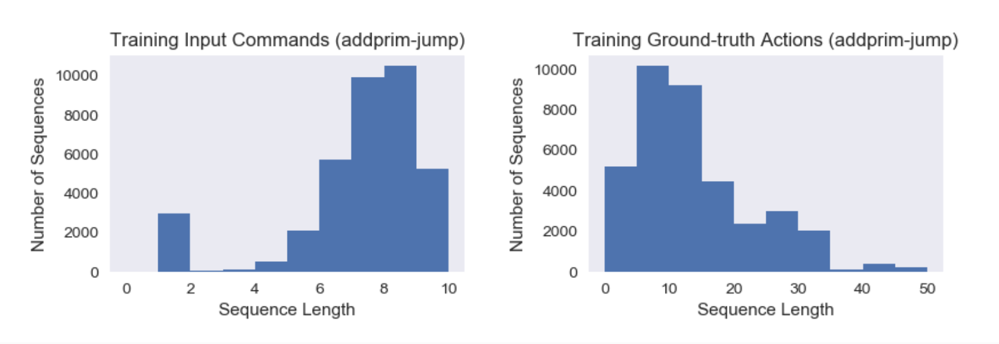
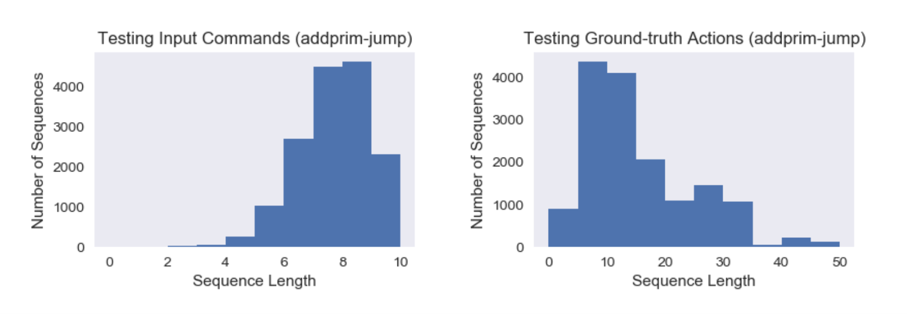

# SCAN-Learn
This is an experiment of compositional learning and zero-shot generalization on the [SCAN task](https://github.com/brendenlake/SCAN) in [*Still not systematic after all these years: On the compositional skills of sequence-to-sequence recurrent networks*.](https://arxiv.org/abs/1711.00350) Lake, B. M. and Baroni, M. (2017). The SCAN tasks were inspired by the CommAI environment, which is the origin of the acronym (Simplified versions of the CommAI Navigation tasks).  

## Requirements
- python 3.6
- pytorch 0.4

## Modifications
- Use GloVe pretrained embeddings with different dimensions (Results not good enough);
- Use Google News 300 Negative word2vec embedding;
- Deepen the Encoder-Decoder model structure;
- Use MSE as an alternative of NLL, for accuracy metrics is defined as: accurate only if the output is identical to the ground truth.

## Data
[**SCAN**](https://github.com/brendenlake/SCAN) consists of a set of commands (see table) and their corresponding action sequences. These are the actions an agent should perform to execute the commands successfully. The commands and actions are defined compositionally based on primitives ("jump", "walk", "run", "turn left", etc.) and modifiers such as "twice", "thrice", "and", "after", "around left", etc. Here are some examples.

|Command | Action sequence |
| --- | --- |
| IN: jump                |                       OUT: JUMP |
| IN: jump left            |                       OUT:  LTURN JUMP |
| IN: jump around right       |                   OUT: RTURN JUMP RTURN JUMP RTURN JUMP RTURN JUMP |
| IN: turn left twice          |                  OUT: LTURN LTURN |
| IN: jump thrice               |                 OUT: JUMP JUMP JUMP |
| IN: jump opposite left and walk thrice   |      OUT: LTURN LTURN JUMP WALK WALK WALK |
| IN: jump opposite left after walk around left | OUT: LTURN WALK LTURN WALK LTURN WALK LTURN WALK LTURN LTURN JUMP |

## Usage
1. Download data from the [SCAN tasks](https://github.com/brendenlake/SCAN) by Lake, B. M. and Baroni, M. (2017);
2. Process the data with **data_process.py**;
3. Run the model with **model.py** `[set options in config.py]`;
4. Evaluate the model with **eval.py** `[set options in config.py]`.  

**NB:**   
The pre-trained embedding weights we use are from [Glove](https://nlp.stanford.edu/projects/glove/) and
[Google word2vec](https://code.google.com/archive/p/word2vec/).

## Results
The performances of the SCAN `Addprim_jump` task are as follows.   
The results strongly support **the vital role of  compositionality** in zero-shot generalization tasks that require systematic skills.

| Prior | Hidden Units | Encoder | Decoder | Training Loss | Test Accuracy |
|:--------:|:---------:|:---------:|:----------:|:----------:|:----------:|
| None | \* | GRU | Attn-GRU | 0.0587 | 1.20% |
| Glove 6b 50d | 50 | GRU | Attn-GRU | 0.2846 | 20.80% |
| Glove 6b 100d  | 100 | GRU | Attn-GRU | 0.1409 | 60.15% |
| Glove 6b 200d  | 200 | GRU | Attn-GRU | 0.0107 | **97.00%** |
| Glove 6b 300d  | 300 | GRU | Attn-GRU | 0.0250 | 94.00% |
| Google News 300d  | 300 | GRU | Attn-GRU | 0.0156 | 90.40% |

\* For non-pretrained trainings, various dimensions have been tested.

## Embedding Correlations

#### 1. Glove 50D Embedding  

Cosine Similarity (GloVe 50)   |  T-SNE  (GloVe 50)
:-------------------------:|:-------------------------:
 | 

#### 2. Glove 100D Embedding  

Cosine Similarity (GloVe 100)   |  T-SNE  (GloVe 100)
:-------------------------:|:-------------------------:
 | 

#### 3. Glove 200D Embedding  

Cosine Similarity (GloVe 200)   |  T-SNE  (GloVe 200)
:-------------------------:|:-------------------------:
 | 

#### 4. Glove 300D Embedding  

Cosine Similarity (GloVe 300)   |  T-SNE  (GloVe 300)
:-------------------------:|:-------------------------:
 | 

#### 5. Google News 300 Negative Embedding  

Cosine Similarity (Google 300)   |  T-SNE  (Google 300)
:-------------------------:|:-------------------------:
 | 

---
## Appendix

### Sequence Lengths Distribution
#### Training Data

#### Testing Data

